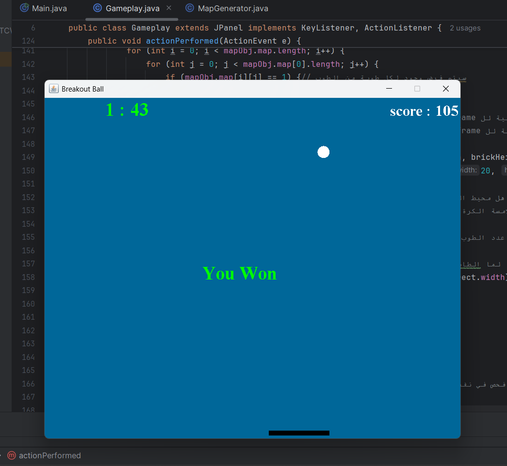
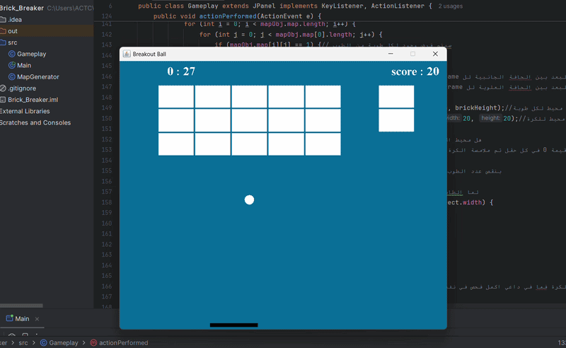

# Brick Breaker

> A high-performance, classic 2D Brick Breaker desktop game built from scratch with Java Swing, featuring a multithreaded engine and real-time physics tracking.

---

## 🎮 Overview

This project is a standalone 2D arcade-style desktop application developed using **Java Core**. It serves as a practical implementation of fundamental computer science and software engineering principles, highlighting how an independent game loop safely coexists with asynchronous user inputs in a graphical desktop environment.

---

## ✨ Features

- **Multithreaded Execution:** Implements a dedicated background thread (`Runnable`) to drive the game loop, decoupled from the main UI Event Dispatch Thread (EDT) for fluid frame updates.
- **2D Vector Physics:** Computes real-time elastic collision detection and precise angle reflection boundaries when the ball interacts with the paddle or brick matrices.
- **Dynamic Map Generation:** Programmatically instantiates, tracks, and layouts the brick grid using a configurable 2D array matrix.
- **State-Driven UI:** Clean separation of UI views for operational active play, dynamic score counters, and definitive "Game Over" or "Victory" states.

---

## 🛠️ Technologies

- **Language:** Java (JDK 8 or higher)
- **GUI Framework:** Java Swing & AWT (`Graphics2D`, `JPanel`, `JFrame`)
- **Execution Model:** Multithreading / Asynchronous Event-Driven Input Handling

---

## 📸 Screenshots

| Active Gameplay Interface | Game Over / Victory Screen |
| :---: | :---: |
|  |

---

## 🎥 Demo

|  |
---

## 🚀 Getting Started

Ensure you have the Java Development Kit (JDK) installed on your system. Follow these commands in your terminal to clone, compile, and execute the project locally:

```bash
# Clone the repository
git clone [https://github.com/khattabzeedan1/Brick-Breaker.git](https://github.com/khattabzeedan1/Brick-Breaker.git)

# Navigate into the source folder
cd Brick-Breaker/src

# Compile all structural Java components
javac Main.java Gameplay.java MapGenerator.java

# Launch the game
java Main
